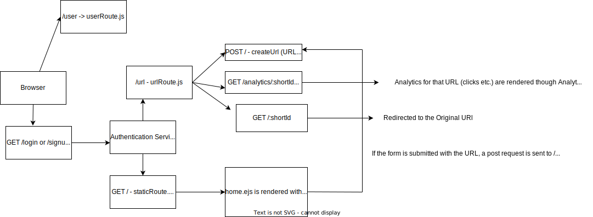

# URL Shortener
1. This is a URL shortener project created using Node.js. 
2. It involves EJS for server side rendering of the UI.
3. MongoDB has been used as the database.
4. Has authentication before user can signup.

## Architecture Diagram - 

## Notes - 
1. Using stateless authentication instead of stateful authentication to prevent load on server and to reduce the failures due to server restart.
2. Using JSON web tokens for authentication purposes. The secret has been stored in the .env file.
3. Also added authorization features to restrict the info page for the analytics of all the URLs to particular roles. (Roles created - Admin, Normal)
4. Also implemented image handling for the user's profile photo.